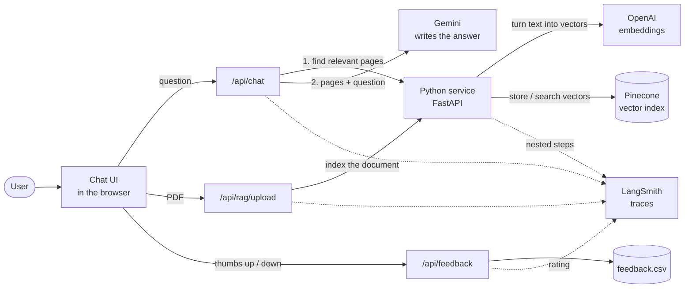

# App Architecture

A Next.js App Router chat app over Google Gemini. Chats run entirely through the
Next.js server; when a PDF is attached, answers are grounded in pages retrieved
from a separate Python (FastAPI) service backed by Pinecone.

> The Draw.io source in [ARCHITECTURE.drawio](./ARCHITECTURE.drawio) predates the
> document Q&A, model settings and tracing work, so the Mermaid diagram below is
> the current one.

## Diagram

Solid arrows are the request path; dotted arrows are tracing.

Without a PDF attached, `/api/chat` skips step 1 and asks Gemini directly.

## Request Flow

**Plain chat (no document attached)**

1. `app/page.tsx` renders the `Chat` client component; conversation state lives in the browser.
2. On submit, the client posts `{ messages, model, generationConfig, docId? }` to `POST /api/chat`.
3. The route keeps the model only if it is allow-listed, clamps every generation
   setting, and passes at most the 6 most recent earlier messages plus the question.
4. Gemini is called through `@google/genai`; 503 ("high demand") is retried twice
   (only before the first chunk has been sent to the browser).
5. The reply is **streamed** back and rendered as it arrives — see below.

**Document question**

1. Same entry point, but the client also sends the attached `docId`.
2. The question is searched **verbatim** (an earlier LLM rewrite step made retrieval worse).
3. `POST /search` on the Python service embeds the question (OpenAI dense + Pinecone
   sparse) and queries Pinecone, filtered to that document.
4. The top pages become a `CONTEXT:` block; a grounded system prompt requires answers
   to come only from it, citing the page label for each claim, or to reply
   "I don't know — the provided documents don't cover this."
5. The reply carries `sources` (filename + page), which the UI shows under the answer.
   Sources are omitted when the model declines.

**Streaming response format**

`/api/chat` answers with newline-delimited JSON (`application/x-ndjson`), one event
per line:

| Event | When | Fields |
| --- | --- | --- |
| `meta` | once before the text (again if sources are withdrawn) | `runId`, `sources`, `docMissing?` |
| `delta` | per chunk of generated text | `text` |
| `error` | the request failed after the stream opened | `error` |

Anything that fails *before* the stream opens (bad body, invalid `docId`, missing API
key) is still a plain JSON error with a status code, so the client has one error path.
The browser appends each `delta` to the assistant message in place; on Stop, whatever
already arrived is kept. Answers that don't come from the model (search unavailable,
document gone, "I don't know") are sent as a single `delta` so the client only handles
one shape.

**Upload**

1. The browser posts the PDF to `POST /api/rag/upload`, which checks the size and proxies it.
2. The Python service verifies it is a PDF, extracts text per page, embeds each page
   and upserts it into Pinecone. Re-uploading the same file is a no-op.

**Feedback**

1. 👍/👎 posts `{ prompt, response, feedback, runId }` to `POST /api/feedback`.
2. One row per prompt/response pair is written to `feedback.csv` (re-rating updates it).
3. With tracing on, the rating is attached to that reply's LangSmith trace as `user_rating`.

## Key Boundaries

- `app/page.tsx` is a server component; `Chat.tsx` is a client component (hooks, browser state).
- API routes are server-only, keeping the Gemini, OpenAI, Pinecone and LangSmith keys
  out of the browser bundle.
- The client never talks to the Python service directly; it goes through `/api/rag/upload`
  and `/api/chat`.
- Requests are cancellable: the Stop button aborts the fetch, and the route passes that
  signal to both the Python search and Gemini. Text that already streamed is kept.
- The traced `chat` run stays open until the stream finishes, so LangSmith still records
  the complete answer and the true end-to-end duration.
- Trace inputs deliberately exclude the Gemini client object, PDF bytes and embedding
  vectors.

## Main Files

- `app/page.tsx` — entry point for `/`
- `app/layout.tsx` — root HTML shell and metadata
- `app/components/Chat.tsx` — chat UI, sidebar, attachments, message actions
- `app/components/ModelSettings.tsx` — generation settings dialog and payload builder
- `app/components/Markdown.tsx` — markdown rendering for answers
- `app/components/types.ts` — shared `Message`, `Conversation`, `Source` types
- `app/api/chat/route.ts` — Gemini bridge and document-grounded answering
- `app/api/rag/upload/route.ts` — PDF upload proxy to the Python service
- `app/api/feedback/route.ts` — CSV feedback log and LangSmith rating
- `app/lib/tracing.ts` — LangSmith client, trace headers, flush after response
- `app/globals.css` — global styling and theme tokens

## Environment

| Variable | Used by | Purpose |
| --- | --- | --- |
| `GOOGLE_GENAI_API_KEY` | Next.js | Gemini API access |
| `RAG_BACKEND_URL` | Next.js | Python service base URL (e.g. `http://localhost:8000`) |
| `LANGSMITH_TRACING`, `LANGSMITH_API_KEY`, `LANGSMITH_PROJECT` | both | Tracing; off unless a key is set |
| `OPENAI_API_KEY`, `PINECONE_API_KEY`, `PINECONE_INDEX_NAME` | Python service | Embeddings and vector index |
