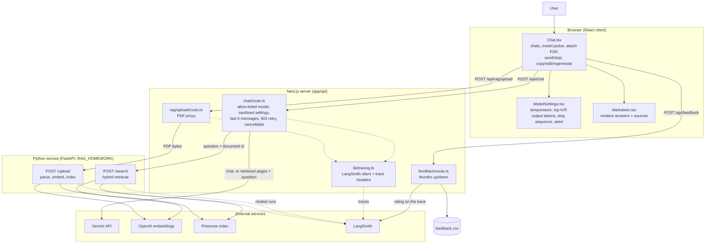

A [Next.js](https://nextjs.org) chat app powered by Google Gemini, with optional
question answering over an uploaded PDF via a separate Python retrieval service.

## Architecture



**Plain chat:** the browser posts the conversation to `/api/chat`, which calls Gemini
and returns the reply.

**Document question:** `/api/chat` sends the question verbatim to the Python service,
which embeds it and searches Pinecone; the top pages are passed to Gemini as context,
and the answer comes back with the page numbers it cites.

**Upload:** the PDF is proxied to the Python service, which extracts the text per page,
embeds it and upserts it into Pinecone.

**Tracing:** when a LangSmith key is set, each request is one trace; the Python
service's steps nest inside it, and 👍/👎 is recorded on the trace.

See [ARCHITECTURE.md](./ARCHITECTURE.md) for the request flow and file-by-file notes.

## Getting Started

First, run the development server:

```bash
npm run dev
# or
yarn dev
# or
pnpm dev
# or
bun dev
```

Open [http://localhost:3000](http://localhost:3000) with your browser to see the result.

You can start editing the page by modifying `app/page.tsx`. The page auto-updates as you edit the file.

This project uses [`next/font`](https://nextjs.org/docs/app/building-your-application/optimizing/fonts) to automatically optimize and load [Geist](https://vercel.com/font), a new font family for Vercel.

## Learn More

To learn more about Next.js, take a look at the following resources:

- [Next.js Documentation](https://nextjs.org/docs) - learn about Next.js features and API.
- [Learn Next.js](https://nextjs.org/learn) - an interactive Next.js tutorial.

You can check out [the Next.js GitHub repository](https://github.com/vercel/next.js) - your feedback and contributions are welcome!

## Deploy on Vercel

The easiest way to deploy your Next.js app is to use the [Vercel Platform](https://vercel.com/new?utm_medium=default-template&filter=next.js&utm_source=create-next-app&utm_campaign=create-next-app-readme) from the creators of Next.js.

Check out our [Next.js deployment documentation](https://nextjs.org/docs/app/building-your-application/deploying) for more details.
